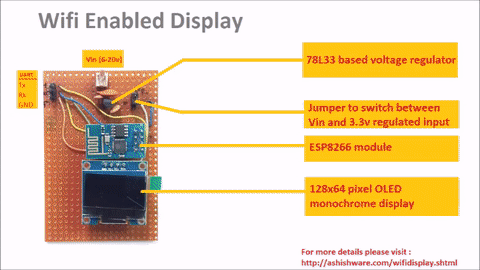

# Wifi OLED Display

This repository contains code for the tiny little display connects to a internet over Wifi and waits for messages. It is possible to send text messages or images to the display via Internet , from your PC , mobile phone or tablet.

You can find more details about this here:
[https://ashishware.com/2015/08/07/WifiDisplay.shtml/](https://ashishware.com/2015/08/07/WifiDisplay.shtml/)
